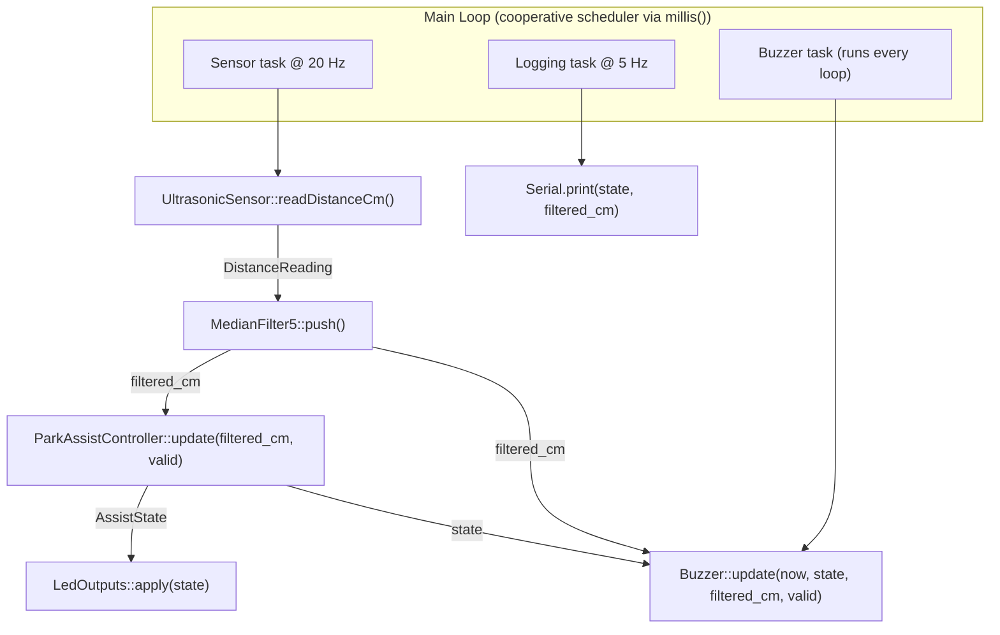

# 🚗 Parking Assist Simulator

A real-time embedded parking assist system built to help with tight garage parking (inspired by helping my mom park in a narrow space).

The goal was to move beyond “Arduino demo code” and design this like production firmware:
- Deterministic timing
- Clean module separation
- State machine logic
- Non-blocking architecture
- Distance-based audio feedback

Link to Project Demo: https://youtu.be/oo_XnNc57rU
---

## 🎯 Motivation

Parking in our garage is tight, and it’s easy to overshoot.  
Instead of buying a commercial unit, I built one from scratch to:

- Learn real-time embedded design
- Implement ultrasonic time-of-flight sensing
- Design a finite state machine with hysteresis
- Avoid blocking firmware patterns (`delay()`)

---

## 🧠 System Overview

**Hardware**
- Arduino Uno R4 Minima (RA4M1)
- HC-SR04 ultrasonic sensor
- 3 LEDs (Green / Yellow / Red)
- Passive piezo buzzer (2048Hz)
- 220Ω current-limiting resistors
- 5V USB-C power

**Distance Zones**

| Distance | State    | Feedback |
|-----------|----------|----------|
| > 60cm    | SAFE     | Green LED |
| 30–60cm   | CAUTION  | Yellow LED + slow → faster beeps |
| < 30cm    | DANGER   | Red LED + fast beeps |
| ≤ 10cm    | CRITICAL | Red LED + continuous tone |
| Invalid   | INVALID  | All off |

---

## ⚙️ How It Works

### Ultrasonic Time-of-Flight

1. Send 10µs trigger pulse  
2. Measure echo return time  
3. Convert time → distance:

distance_cm = (echo_time_us × 0.0343) / 2

Division by 2 accounts for round-trip travel.

---

## 🏗 Firmware Architecture

Structured like a real embedded project:

Parking-Assist-Simulator/

├── Ultrasonic.h

├── MedianFilter.h

├── Controller.h / .cpp

├── Outputs.h / .cpp

├── Buzzer.h

└── Parking-Assist-Simulator.ino

## 🧩 Architecture Diagram

### Key Components

**Ultrasonic Module**
- Encapsulates trigger + echo logic
- Returns validated distance readings

**Median Filter (size 5)**
- Removes spikes
- Prevents flicker near thresholds

**Finite State Machine**
- States: `INVALID`, `SAFE`, `CAUTION`, `DANGER`
- ±3cm hysteresis to prevent thrashing
- Explicit transition logic

**Buzzer Subsystem**
- Fully non-blocking (`millis()`-based)
- Distance → cadence mapping
- Continuous tone at critical proximity
- No `delay()` used

---

## ⏱ Real-Time Design

- Sensor sampling: 20 Hz  
- Logging: 5 Hz  
- Audio cadence handled independently  
- Cooperative scheduling using `millis()`

All modules operate without blocking delays.

---

## 🔍 Key Engineering Decisions

- Used median filtering instead of moving average for spike resistance
- Added hysteresis to prevent state oscillation
- Removed unnecessary voltage divider after validating R4 5V logic
- Designed buzzer as a separate module to preserve clean architecture

---

## ⚡ Power Usage

~40mA @ 5V (~0.2W)

Safe to leave on 24/7 in a garage.  
Costs roughly a few cents per month to operate.

---
